# Jokes all day
*Jokes all day* is the place to go if you want a big ol' laugh! See some of the worlds best jokes and take part in the community yourself!

This is a project created under the Code Institute flag, being the portfolio project 5. It is for learning purposes only.

Find the live site [here](https://jokes-all-day-frontend-26d817bb989c.herokuapp.com)

## Contents

* [Project Planning](#project-planning)
    * [Agile Methods](#agile-methods)
    * [MoSCoW method](moscow-method)
    * [Epics, User Stories, Issues](#epics-user-stories-issues)
        * [Epic: Setup](#epic-setup)
        * [Epic: User Accounts](#epic-user-accounts)
        * [Epic: Joke (with full CRUD)](#epic-joke-with-full-crud)
        * [Epic: Interaction](#epic-interaction)
        * [Epic: Site owner administration](#epic-site-owner-administration)
    * [Wireframes](#wireframes)
* [User Experience](#user-experience)
    * [Layout](#layout)
    * [Colour Scheme](#colour-scheme)
    * [Font](#Font)
* [Features](#features)
    * [CRUD functionality](#crud-functionality)
    * [Feature showcase](#feature-showcase)
        * [Navbar](#navbar)
        * [Sign Up / Login](#sign-up--login)
        * [Home page](#home-page)
        * [Feed page](#feed-page)
        * [Profile page](#profile-page)
        * [Report page](#report-page)
        * [Error page](#error-page)
    * [Future Features](#future-features)
        * 
* [Technologies and Languages used](#technologies-and-languages-used)
* [Testing](#testing)
* [Deployment](#deployment)
    * [Creating the React App](#creating-the-react-app)
    * [Deploying on Heroku](#deploying-on-heroku)
    * [How to fork](#how-to-fork)
    * [How to clone](#how-to-clone)
* [Credits](#credits)
    * [Code](#code)
    * [Acknowledgements](#acknowledgements)

## Project Planning
The objective of this site is to give the users a laugh. *Laughter is the best medicine* is obviously not true in a literal sense, but absolutely true figuratively speaking. 

Users can post jokes that the rest of the community can take part of. A star rating system gives the user instant feedback on their jokes, both separately and as an average on all the posted jokes.

**Site Goals**
* Provide an easy way to good jokes
* Have a nice look with good responsiveness
* Have easy to use features
* Have an easy to use report function to keep the quality of the site high

### Agile Methods
This project was developed with agile methods. As some features depended on others to be built, the obvious way was to start with the most fundamental features and user stories first and work upwards.

Only one iteration has been completed and future features are planned to take place in the second iteration.

### MoSCoW Method
The issues created for this site were labeled with the use of the MoSCoW method. That divides the labels into:

* Must have - features that is a must for the site to be working as intended
* Should have - features that the site should have to be of use to the user
* Could have - features that could bring that little extra to the user
* Won't have - features that no longer fit the project or won't be included in this release

### Epics, User Stories, Issues
#### Epic: Setup
- Create a repository at Github and use it to create a workspace in Gitpod.
- Install React in the workspace
- Install React Bootstrap, React Infinite Scroll and other necessary packages

#### Epic: User Accounts 
- As a user, I can easily find the login and logout button, so that I can enter and leave the site when I please
- As a non logged in user, I can easily find the account pages, so that I can create an account and log in

#### Epic: Joke (with full CRUD)
- As a user, I can create a joke, so that I can share my comedy with other users
- As a user, I can see my own jokes, so that I can get a clear picture of what jokes I have posted
- As a user, I can edit my own joke, so that I can update it to my satisfaction
- As a user, I can delete my joke, so that I can choose what jokes to display to other users

#### Epic: Interaction
- As a user, I can see jokes by other users, so that I can take part in the joke community
- As a user, I can search the feeds, so that I can find a specific joke or user
- As a user, I can rate other users jokes, so that I can share how much I liked it
- As a user, I can see my own given average rating, so that I can display my rating to other users
- As a user, I can see a jokes average rating, so that I can see what users think of that joke
- As a user, I can report a joke, so that I can let admin know that I find the joke offensive

#### Epic: Site owner administration
- As an admin, I can handle reports, so that I can keep track of which reports have been dealt with
- As an admin, I can delete a joke, so that I can maintain a high quality site

### Wireframes
The site was developed mobile first. The desktop wireframes are therefor bigger versions of the mobile wireframes. Some features were removed after the design process when a smaller scope was determined. More information can be found at [Future features](#future-features).

**Mobile**

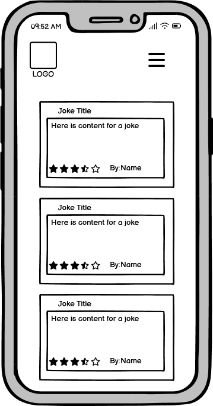
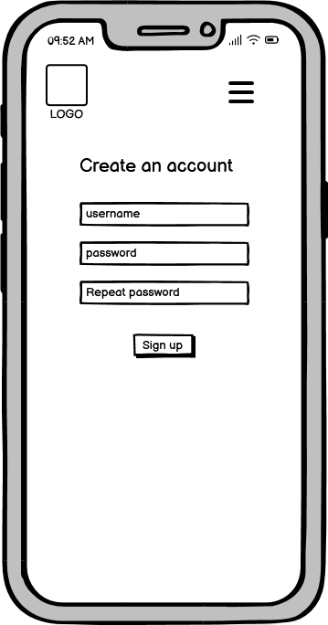
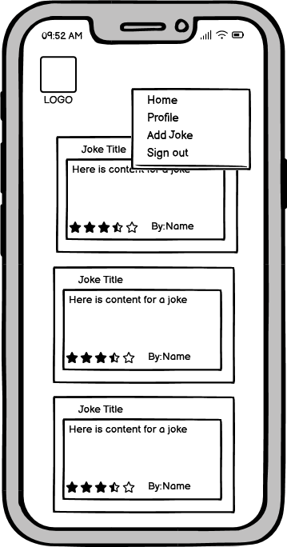
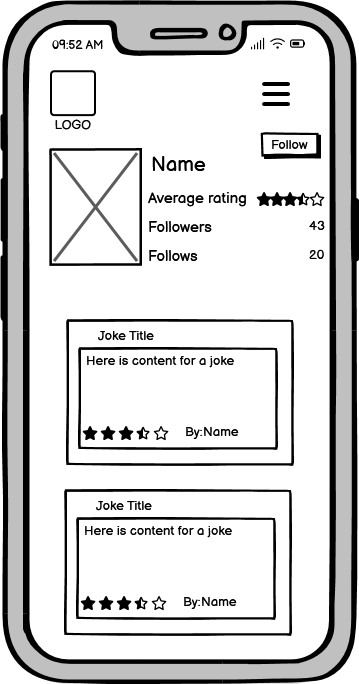
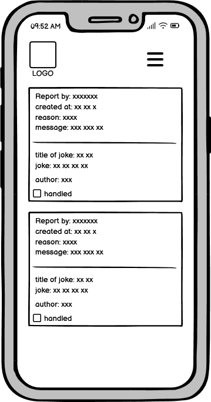

**Desktop**

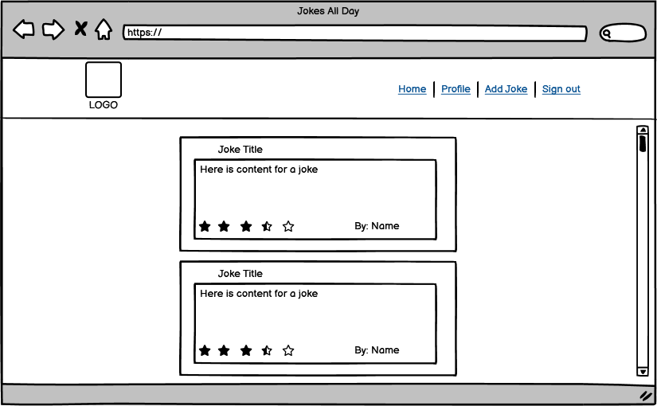
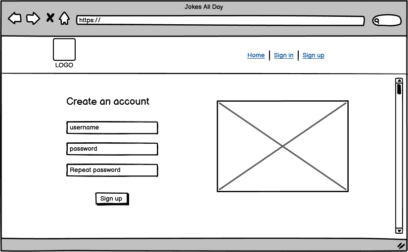
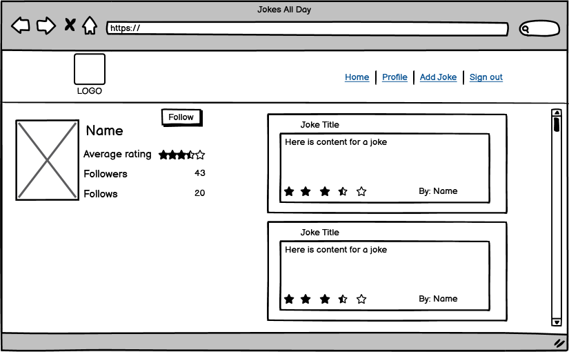
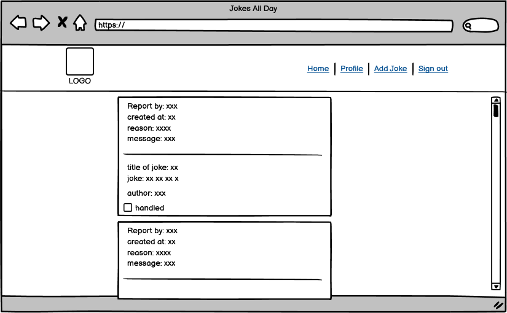

## User Experience

### Layout
The site does not house a exaggerated amount of features, at least not at this point. With that in mind the site are designed to have a clean look and be easy to navigate. The navigation bar with the logo and links are always displayed at the top of the page. Depending on the logged in status, different links are shown.

The jokes, the profiles and the reports have quite a similar look with e.g. a frame around it's content and all lowercase letters.

### Colour Scheme
The colours are chosen to contrast eachother. By keeping the number of colours to a few, the consistency of the site grows and it feels more well thought out.

The colour pallette is created at [coolors.co](https://coolors.co)

- E0DCDA - Light grey, used for background
- D4CFC4 - Light grey, used for navbar background
- 4A4238 - Brown, used for text and borders
- 8E5C42 - Orange brown, used for details

### Font

The used font is "Cutive". It is imported from Google Fonts.

## Features
### CRUD functionality
This site contain six different models: User (Djangos), Profile, Joke, Rating, Report, Followers.

A User has a Profile. A Profile can create Jokes, Rate other jokes, Report other jokes and Follow other Users.

### Feature showcase
#### Navbar
The Navbar is simple. A logo of a laughing person, a title and links to different features. It is clean and responsive. Under the width of 768px, the navbar turns into a hamburger icon that the user can toggle.

#### Sign Up / Login
The Sign Up and Login pages are simple and easy to use. The site only uses a username to identify the user so only username and password are required to enter on sign up and login.

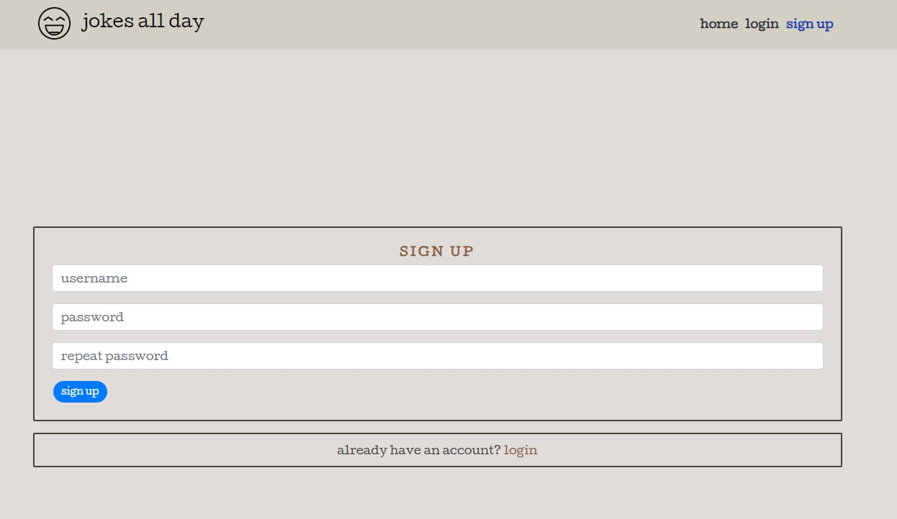
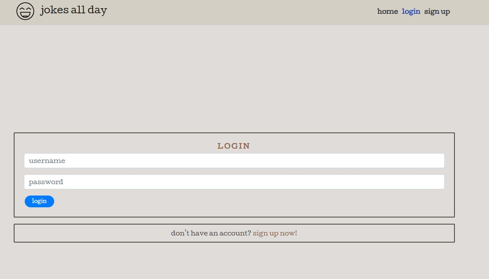

#### Home page
The home page is shown to both logged in and not logged in users. It displays all of the sites published jokes. At the top is a search bar that allows the user to search for jokes by titles and authors. 

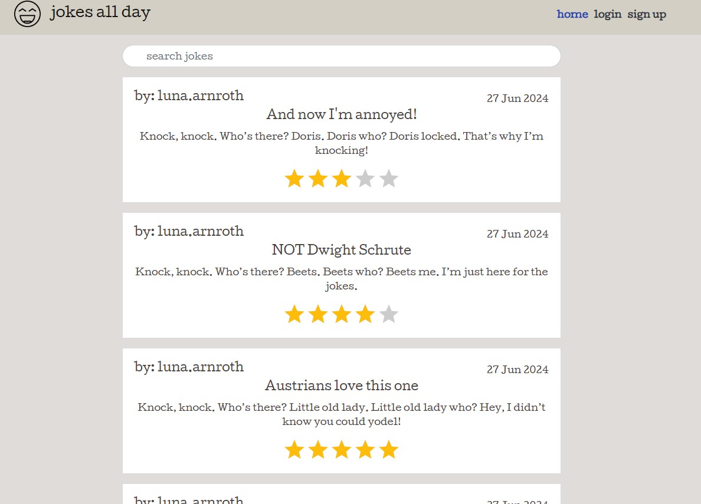

#### Feed page
The feed page is exactly as the home page with the difference that it only displays jokes from user that are followed by the current user.

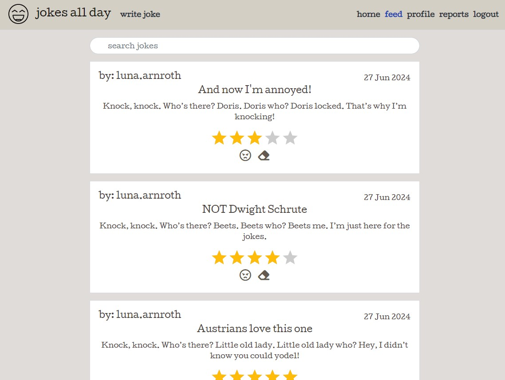

#### Profile page
The profile page is divided to two sections: the profile and the profile jokes.

The profile contains information about the user. It contains: the username, amount of jokes published, amount of followers, amount of users followed, the users average received rating and (if the current user is not looking at their own profile), a follow/unfollow button.

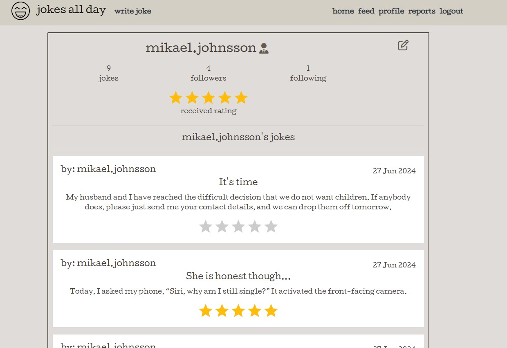

#### Report page
A report contain an author, the report itself, when it was created, reason for report and also all the information about the reported joke.

At the report page a regular user can see all of their own written reports. It is easy to click into the report and use the edit / delete functionality.

If the user is an admin they see all written reports. They can also edit / delete the report and also check the report as handled. Using the link to the joke it is easy for an admin to click into the reported joke and use the edit / delete functionality.

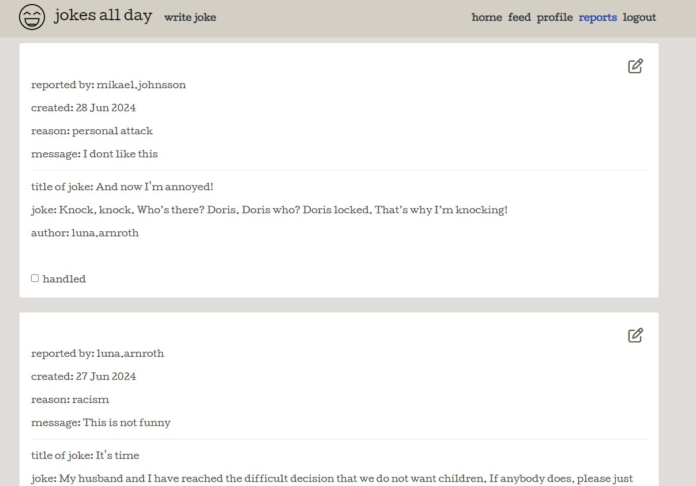

#### Error page
If a user enters a URL not found by the site, an error message shows up. The navbar is always visible so it is easy to navigate back to whatever page is desired.

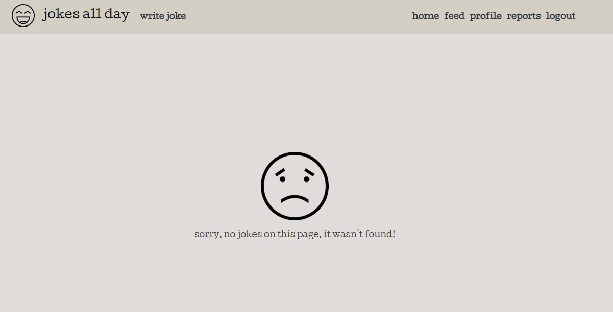

### Future features

- In the reports, being able to see how many reports a joke has
- A loading spinner when data is loading
- A section where the top rated jokes are displayed
- A section where the most followed / top rated users are displayed
- A message to be sent to the user who reported a joke when the report has been handled
- An overlay message that it is not possible to rate ones own joke

## Technologies used
- **HTML5**, used to create the structure of the site
- **CSS**, used to add custom styling
- **JSX**, used to add interactivity
- **React**, Javascript library used to create a dynamic and fast application
- **React Bootstrap**, used for easy styling
- **CI Database**, used for data storage
- **Balsamiq**, used for creating wireframes
- **Am I responsive?**, used for responsiveness imagery
- **Coolors**, used for creating colour pallette
- **Gitpod**, used for writing code in
- **Github**, used for storing code in 
- **Heroku**, used for deployment

## Testing
Testing of the site can be found [here](TESTING.md).

## Deployment
### Creating the React App
This is how this React App was created:
1. [This](https://github.com/Code-Institute-Org/gitpod-full-template) Code Institute template was used
2. When own repository had been created, a Gitpod workspace was created
3. React was installed using a Code Institue template: `npx create-react-app . --template git+https://github.com/Code-Institute-Org/cra-template-moments.git --use-npm` 
4. Tested if app preview is starting: `npm start`
5. A moving React logo was displayed, so the app was working

### Deploying on Heroku
This app was deployed using Heroku.
1. Create an account and / or login to Heroku.
2. Click "New" and "Create new app"
3. Choose a name and a region
4. In deploy, connect Heroku App to you Github repository
5. Deploy through automatic or manual deployment

### How to fork
These are instructions how to fork the app from Github:

1. Sign in / create an account at [Github](https://www.github.com)
2. Go to the application's repository [*jokes-all-day*](https://github.com/mikael-johnsson/jokes-all-day)
3. Click "Fork" > "Create a new fork"
4. Choose an appropriate name and click "Create Fork"

### How to clone
These are instructions how to fork the app from Github:

1. Sign in / create an account at [Github](https://www.github.com)
2. Go to the application's repository [*jokes-all-day*](https://github.com/mikael-johnsson/jokes-all-day)
3. Click "Code"
4. Choose to clone via HTTPS, SSH-key or Github CLI
5. Go to IDE of choice, I chose Gitpod
6. Create workspace via chosen clone way from step 4

## Credits
### Code
**Code Institute**

This site is heavily inspired by the Code Institute "Moments" walkthrough project. Similarities can be found in features, design, layout and code.

Hard credits go to CI for:
- User accounts and authorization
- The use of context
- The use of utils
- The use of Axios
- The MoreDropDown component
- The hooks
- The general structure of the code (a joke goes in a joke page and a jokefeed etc.)

**Alerts useEffect functionality**

The way the Alerts useEffect functionality works is all due to Sandra Bergström and her [Travel Ticker-project](https://github.com/SandraBergstrom/travel-tickr)

### Acknowledgments
Thank you to my mentor Gareth McGirr for contributing with important insight of the code.
