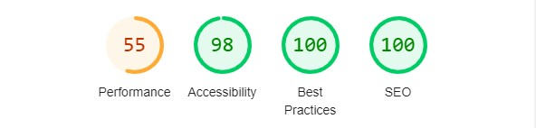

# Testing for *Jokes all day*

This is the testing for the site *Jokes all day*.

Link to live site [here](https://jokes-all-day-frontend-26d817bb989c.herokuapp.com/)

Find the README [here](README.md).
## User Story testing

|User Story|Working|
|-|-|
|Epic: *User Accounts*||
|As a user, I can easily find the login and logout button, so that I can enter and leave the site when I please|✔️|
|As a non logged in user, I can easily find the account pages, so that I can create an account and log in|✔️|
|Epic: *Joke (with full CRUD)*||
|As a user, I can create a joke, so that I can share my comedy with other users|✔️|
|As a user, I can see my own jokes, so that I can get a clear picture of what jokes I have posted|✔️|
|As a user, I can edit my own joke, so that I can update it to my satisfaction|✔️|
|As a user, I can delete my joke, so that I can choose what jokes to display to other users|✔️|
|Epic: *Interaction*||
|As a user, I can see jokes by other users, so that I can take part in the joke community|✔️|
|As a user, I can search the feeds, so that I can find a specific joke or user|✔️|
|As a user, I can rate other users jokes, so that I can share how much I liked it|✔️|
|As a user, I can see my own given average rating, so that I can display my rating to other users|✔️|
|As a user, I can see a jokes average rating, so that I can see what users think of that joke|✔️|
|As a user, I can report a joke, so that I can let admin know that I find the joke offensive|✔️|
|Epic: *Site owner administration*||
|As an admin, I can handle reports, so that I can keep track of which reports have been dealt with|✔️|
|As an admin, I can delete a joke, so that I can maintain a high quality site|✔️|

## Automated Testing
### W3C HTML

W3C HTML validator checks for errors and warnings in the deployed html code. This site was run through the validator and came back with no errors or warnings. It did display info about unnecessary trailing slashes.

### W3C CSS
W3C CSS validator checks for errors and warnings in the sites css pages. These are the results:

|File|Errors|
|-|-|
|App.module.css|No errors|
|Alert.module.css|No errors|
|Button.module.css|No errors|
|Joke.module.css|No errors|
|JokeFeed.module.css|No errors|
|MoreDropdown.module.css|No errors|
|NavBar.module.css|No errors|npm start
|NotFound.module.css|No errors|
|SignInUpForm.module.css|No errors|

### Prettier
The extension Prettier formats documents by a good coding standard. It makes the code more readable. Prettier has been used on all files in this project.

### Lighthouse
Lighthouse is a tool in Google Chrome Devtools that analyze a website on it's Performance, Accessibility, Best Practices and SEO. These are this sites results:

*Home page, desktop*

*Profile page, desktop*

*Report page, desktop*

*Home page, mobile*

*Profile page, mobile*

*Report page, mobile*

**Conclusion:**

There is absolutely work to be done in the performance area. As of now, the site is a bit too slow. Actions to be taken in a later iteration:
- Improve imports. React bootstraps imports are not written in the most efficient way. This means longer loading times as unnecessary data is being loaded.
- More efficient code. A lot of data handling of the site ends with a page reload. A more efficient code would use the full strength of React and only re-render affected components.

## Manual Testing
### Not logged in User
*NavBar*
|Feature|Expected Outcome|Testing Performed|Result|
|-|-|-|-|
|Navbar|Displaying when entering site|Enter site|Pass|
|Correct links|Links *home*, *login* and *sign up* should display|Enter site|Pass|
|*Home*-link|Redirect to home page|Click|Pass|
|*Login*-link|Redirect to login page|Click|Pass|
|*Sign up*-link|Redirect to sign up page|Click|Pass|

*Sign up page*
|Feature|Expected Outcome|Testing Performed|Result|
|-|-|-|-|
|Username field|Show error message if empty when submitted|Submit empty|Pass|
|Password field|Show error message if empty when submitted|Submit empty|Pass|
|Repeat password field|Show error message if empty when submitted|Submit empty|Pass|
|Password field|Display error message when password criteria not met|Enter password to short/common/similar to username|Pass|
|*Sign up*-button|Attempt to submit data|Click|Pass|
|Form|Create account when all fields entered correctly and submitted|Enter fields correctly and submit|Pass|
|*Login*-link|Redirect to login page|Click|Pass|

*Login page*
|Feature|Expected Outcome|Testing Performed|Result|
|-|-|-|-|
|Username field|Show error message if empty when submitted|Submit empty|Pass|
|Password field|Show error message if empty when submitted|Submit empty|Pass|
|Form|Show error message if not matching data is submitted|Submit faulty login credentials|Pass|
|Form|Login user when correct login credentials are submitted|Submit correct credentials|Pass|
|*Sign up*-link|Redirect to sign up page|Click|Pass|

*Home page*
|Feature|Expected Outcome|Testing Performed|Result|
|-|-|-|-|
|Jokes|Display all the sites jokes, ordered from last created|Click *home*-link|Pass|
|Ratings|Not able to rate jokes|Click stars|Pass|
|Profile link|Redirected to joke author's profile|Click joke author name|Pass|
|Joke link|Redirected to joke page|Click joke title|Fail|
|Infinite scroll|First display first ten jokes, when scrolling down - load more|scroll down|Pass|

Joke link - due to values regarding the admin status of the current user, it is not possible to view the joke page when not logged in.

### Logged in User
*NavBar*
|Feature|Expected Outcome|Testing Performed|Result|
|-|-|-|-|
|Correct links|Links *write joke*, *home*, *feed*, *profile*, *reports* and *logout* should display |login user|Pass|
|*write joke*-link|redirect to create joke page|click|Pass|
|*home*-link|Redirect to home page|Click|Pass|
|*feed*-link|Redirect to feed page|Click|Pass|
|*profile*-link|Redirect to users profile page|Click|Pass|
|*reports*-link|Redirect to reports page|Click|Pass|
|*logout*-link|logout user|click|Pass|

*create joke page*
|Feature|Expected Outcome|Testing Performed|Result|
|-|-|-|-|
|Form|Form input for title and content displaying|Enter page|Pass|
|Title field|Show error message if empty when submitted|Submit empty|Pass|
|Content field|Show error message if empty when submitted|Submit empty|Pass|
|Form|Create joke and redirect to created joke when submitting correct data|Submit correct data|Pass|
|*Cancel*-button|Redirect to previous page|Click|Pass|
|*Create*-button|Submit form with correct data|Click when correct data entered|Pass|

*edit joke page*
|Feature|Expected Outcome|Testing Performed|Result|
|-|-|-|-|
|Form|Values for title and content displaying|Enter page|Pass|
|Title field|Show error message if empty when submitted|Submit empty|Pass|
|Content field|Show error message if empty when submitted|Submit empty|Pass|
|Form|Update joke and redirect to updated joke when submitting correct data|Submit correct data|Pass|
|*Cancel*-button|Redirect to previous page|Click|Pass|
|*Save*-button|Submit form with correct data|Click when correct data entered|Pass|

*Joke page*
|Feature|Expected Outcome|Testing Performed|Result|
|-|-|-|-|
|Rating|If owner, not allowed to rate joke|Click stars|Pass|
|Rating|If not owner, able to rate joke|Click stars|Pass|
|Rating|If already rated by user, able to clear rating|Click eraser|Pass|
|Rating|If already rated by user, able to update rating|Click stars|Pass|
|Report|If not owner, able to click report joke button and be redirected to create report page|Click angry face icon|Pass|
|Edit/delete|If owner, able to click edit/delete menu button. Menu appears.|Click|Pass|
|Edit button|Redirect to edit joke form|Click|Pass|
|Delete button|Delete joke and redirect to home page|Click|Pass|
|Profile link|Redirected to joke author's profile|Click joke author name|Pass|
|Joke link|Redirected to joke page|Click joke title|Pass|
|Alerts|Alerts displaying correct message when rating created, edited or deleted|Handle ratings|Pass|

*Home page*
|Feature|Expected Outcome|Testing Performed|Result|
|-|-|-|-|
|Jokes|Display all the sites jokes, ordered from last created|Click *home*-link|Pass|
|Rating|If owner, not allowed to rate joke|Click stars|Pass|
|Rating|If not owner, able to rate joke|Click stars|Pass|
|Rating|If already rated by user, able to clear rating|click eraser|Pass|
|Rating|If already rated by user, able to update rating|click stars|Pass|
|Report|If not owner, able to click report joke button and be redirected to create report page|Click angry face icon|Pass|
|Profile link|Redirected to joke author's profile|Click joke author name|Pass|
|Joke link|Redirected to joke page|Click joke title|Pass|
|Alerts|Alerts displaying correct message when rating created, edited or deleted|Handle ratings|Pass|
|Infinite scroll|First display first ten jokes, when scrolling down - load more|scroll down|Pass|
|Search bar|filter jokes based on title and joke author username|Enter text in search bar|Pass|

*Feed page*
|Feature|Expected Outcome|Testing Performed|Result|
|-|-|-|-|
|Jokes|Display jokes only by users that the current user follows|Enter page|Pass|

*Profile page*
|Feature|Expected Outcome|Testing Performed|Result|
|-|-|-|-|
|Username|Profile owners username displays|Enter page|Pass|
|*follow*-button|If not following profile owner: display, follow user, change to *unfollow*|Click|Pass|
|*unfollow*-button|If following profile owner: display, unfollow user, change to *follow*|Click|Pass|
|Edit button|If owner, able to click edit menu button. Menu appears.|Click|Pass|
|*change username*-link|Redirect to change username form|Click|Pass|
|*change password*-link|Redirect to change password form|Click|Pass|
|Statistics|Amount of jokes, followers and following displays|Enter page|Pass|
|Rating|Average received rating displays|Enter page|Pass|
|Jokes|Jokes by the profile owner displays|Enter page|Pass|

*Report page*
|Feature|Expected Outcome|Testing Performed|Result|
|-|-|-|-|
|Reports|Reports written by current user displays|Enter page|Pass|
|Report|Reports contain all report data and title, content and author of reported joke|Enter page|Pass|
|Edit/delete|If owner, able to click edit menu button. Menu appears.|Click|Pass|
|*edit*-link|Redirect to edit report form|Click|Pass|
|*delete*-link|Delete report and redirect to home page|Click|Pass|
|Joke link|Redirect to joke when clicking title|Click title|Pass|
|Alert|Alert regarding succeeded deletion of report appearing at home page after redirection|Click delete|Pass|

*Create report page*
|Feature|Expected Outcome|Testing Performed|Result|
|-|-|-|-|
|Form|Form input for reason and content displaying|Enter page|Pass|
|Reason field|Show error message if empty when submitted|Submit empty|Pass|
|Content field|Show error message if empty when submitted|Submit empty|Pass|
|Form|Create report and redirect to report page when submitting correct data|Submit correct data|Pass|
|*Submit report*-button|Submit form with correct data|Click when correct data entered|Pass|

*Edit report page*
|Feature|Expected Outcome|Testing Performed|Result|
|-|-|-|-|
|Form|Values for reason and content displaying|Enter page|Fail|
|Reason field|Show error message if empty when submitted|Submit empty|Pass|
|Content field|Show error message if empty when submitted|Submit empty|Pass|
|Form|Update report and redirect to report page when submitting correct data|Submit correct data|Pass|
|*Save report*-button|Submit form with correct data|Click when correct data entered|Pass|

### Admin
|Feature|Expected Outcome|Testing Performed|Result|
|-|-|-|-|
|Reports|Able to edit and delete all reports, not just created by admin|Handle reports|Pass|
|Reports, handled|Able to mark reports as handled|Handle jokes|Pass|
|Jokes|Able to edit and delete all jokes, not just created by admin|Handle jokes|Pass|

## Bugs
### Remaining bugs
**Login bug**
This appears to be a bug only affecting me, the developer. As of now, I am unable to login to the deployed site on Google Chrome. An error message about "No valid refresh token found" appears.

### Fixed bugs
**Gitpod workspace bug**
When first creating the Gitpod workspace with the CI Full Template, it was not possible. An error message of "headless task failed: exit status 1" appeared.

With the help of CI tutors, the reason was found. Something kept MongoDB being installed. It was temporarily removed from the template.

**Name duplicate**
When creating the react app (in the main directory), an error about conflicting names appeared. The solution was to create the app inside another directory, and then deleting the unwanted directory.

### Flaws
**Average rating, jokes**
When displaying a joke, the jokes average rating is displayed by the stars. When adding a rating the average rating should change. That happens in the backend, but not in the frontend. A refresh is necessary to see the updated average rating. This is due to not being able to recount the average rating in the setState function used.

**Handle value, report page**
It has not been possible to re-render the affected report component when admin changes status on handle value. Therefor the page refreshes.

**Infinite scrol, report page**
The report page does not use the Infinite scroll function and can therefor only display the ten latest reports.

**Personal attack value, reports**
At the moment, the Report reason "personal_attack" is changed to "personal attack" by a to_representation function in the backend. That causes problems and when editing a form with that value, the "Choose a reason" value is default and an error appears when trying to submit with "Choose a reason" value.

**Loading spinner**
This site needs some sort of loading spinner that displays when loading jokes or reports. This is not implenented yet.

**Access edit report form**
As of now, it is possible for a user, who is not and admin nor the owner of the report, to enter the edit report form. It is not possible to actually edit it though.

**Cancel button on report forms**
As of now, the create report form and edit report form does not have a cancel button. If the user wants to cancel the form handling, they need to use the navbar.
